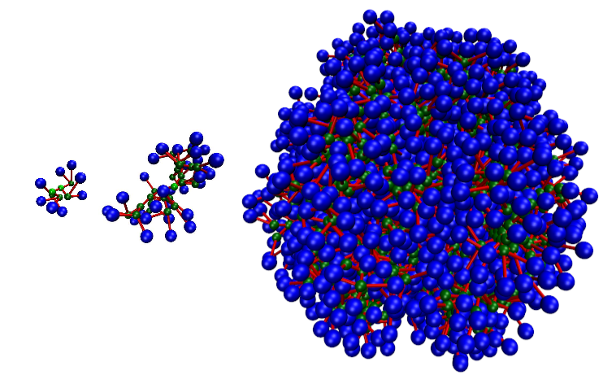
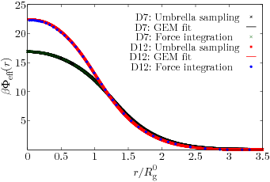
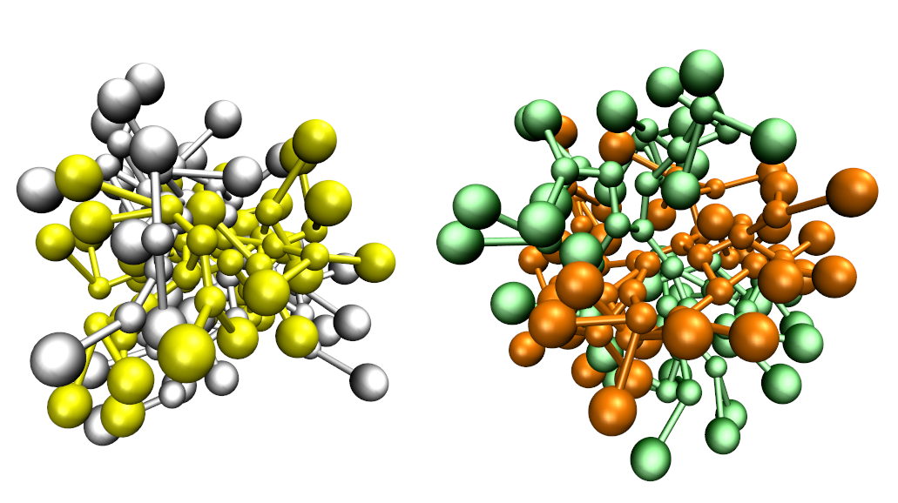

# dendrimer-sim-package
 
 
Simulation package written in C for performing Monte Carlo Simulation of classical mechanical models of dendritic liquids.

 
Contains: 

Monte Carlo simulations on single processor 

Compiling:
----------

The code is ansi standard C and must be compiled from source. 
The build system requires the gnu version of the unix Make-utility.
Compile using the -std=c99 options

- cd to the src/ directory
- type make [option] where option: single, inter, anneal, widom, umbrella, eff. The resulting executables (single, inter, anneal, widom, umbrella, umbrellabias, eff) will be generated in the run directory 

The chemical bonds between monomers of a single dendimers were modeled via the finite extensible nonlinear elastic (FENE) potential defined as
 

 <!--- $\beta \Phi_{\mu \nu }^\text{FENE}(r) = 
-K_{\mu \nu }R_{\mu\nu }^2\ln\!
\left(1-\left( \frac{r-l _{\mu\nu}^0}{R_{\mu \nu}}\right)^2\right)'$--->
All of the dendrimer monomers separated by a distance r interact via a Morse potential:
 

<!---\beta \Phi_{\mu \nu }^\mathrm{Morse}(r) = \varepsilon_{\mu \nu } 
\left\lbrace 
\left[ \exp\left({-\alpha_{\mu \nu}\left(  r{-}d_{\mu \nu} \right)}\right) -1 \right]^2  - 1 
\right\rbrace--->
or via a Lennard-Jones potential (please see -LJ==1 directive)
 
Optimizations (using pre-processor directives)
-----------------------------------------------
- LJ: when set to 1 the Morse Potential will be employed to imitate the Lennard-Jones interaction. See a detailed description here: http://www.znaturforsch.com/aa/v58a/s58a0615.pdf
- USE_CELL_LIST: set to 1 to enable linked-list cells. The simulation box is then divided into small cells of equal size. Each cell size is set to the cut-off length of the Morse potential.
- CELL_SEC_NEI: set to 1 to include interaction of second neighboring cells (not needed)
- USE_PBC: set to 1 to apply the Periodic Boundary Conditions "PBC". The simulation box is then surrounded by its translational images in the three directions of space.
- LUT_FENE: use tabulated potentials for FENE interaction 
- LUT_MORSE: use tabulated potential for MORSE interaction 

Executables:
---------------

All executable are located inside the run/ folder.
Use the relevant scripts to run the program

- single: Simulation of a single dendrimer
- inter: Simulation of a dendimer liquid
- anneal: Simulation of a dednrimer liquid using simulated annealing
- Effective interactions
 
 

 
 
 * eff: Extract effective interaction between two dendrimers using the force integration method
 * umbrella: Effective interaction calculation using the umbrella sampling method
 * umbrellabias: Calculate the effective interaction using a tabulated potential
 * widom: Widom particle insertion method for calculating effective interactions
 * Use script provided in https://github.com/gi82/combine-umbrella-windows to combine the results for the effectve interaction produced by the umbrella simulation

