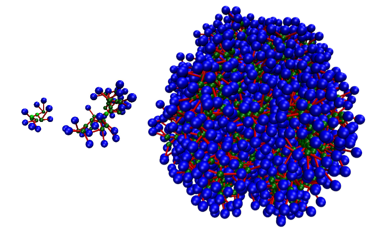

# dendrimer-sim-package

A Monte Carlo simulation package written in C for studying classical mechanical models of dendritic liquids. Originally developed as part of a PhD in computational physics, the package supports single-dendrimer characterization, bulk liquid simulations, effective interaction calculations, and free-energy methods.
<br/>
<br/>

<br/>


***

## Table of Contents

- [Overview](#overview)
- [Physics Model](#physics-model)
- [Prerequisites](#prerequisites)
- [Building the Code](#building-the-code)
- [Executables](#executables)
- [Compile-Time Options](#compile-time-options)
- [Input Files](#input-files)
- [Output](#output)
- [Effective Interactions](#effective-interactions)
- [Citation](#citation)

***


## Overview

The package implements single-processor Monte Carlo (MC) simulations of amphiphilic dendrimers modeled as coarse-grained bead-spring molecules. Key capabilities:

- Monte Carlo simulations of single dendrimers and dendrimer liquids
- Simulated annealing for structural equilibration
- Effective pair interaction extraction via multiple methods:
  - Force integration
  - Umbrella sampling
  - Biased umbrella sampling (tabulated potential)
  - Widom particle insertion
- Periodic boundary conditions (PBC)
- Linked-list cell decomposition for O(N) neighbor search
- Lookup table (LUT) acceleration for FENE and Morse potentials
- Flexible compile-time configuration via preprocessor directives

***

## Physics Model

### Bond Potential — FENE

Chemical bonds between monomers within a single dendrimer are modeled via the **Finite Extensible Nonlinear Elastic (FENE)** potential:

$$U_\mathrm{FENE}(r) = -K_1 R_1^2 \ln\!\left(1 - \left(\frac{r - r_{01}}{R_1}\right)^2\right)$$

where $K_1$ is the spring constant, $R_1$ is the maximum extensibility, and $r_{01}$ is the equilibrium bond length.

### Non-Bonded Potential — Morse

All dendrimer monomers separated by distance $r$ interact via the **Morse** potential (default):

$$U_\mathrm{Morse}(r) = \epsilon \left[\left(e^{-a(r-d)} - 1\right)^2 - 1\right]$$

where $\epsilon$ is the well depth with minimum value $-\epsilon$ at $r = d$, $d$ is the equilibrium bond distance, and $a$ controls the range/curvature of the well.

For a detailed description of using the Morse potential to approximate Lennard-Jones interactions, see:  
[Z. Naturforsch. 58a, 615 (2003)](http://www.znaturforsch.com/aa/v58a/s58a0615.pdf)

### Non-Bonded Potential — Lennard-Jones (optional)

When compiled with `-DLJ=1`, the standard 12-6 **Lennard-Jones** potential is used instead of Morse:

$$U_\mathrm{LJ}(r) = 4\epsilon \left[\left(\frac{\sigma}{r}\right)^{12} - \left(\frac{\sigma}{r}\right)^{6}\right]$$

All quantities are expressed in **reduced units** (energy in units of $\epsilon$, length in units of $\sigma$).

***

## Prerequisites

| Requirement | Version |
|---|---|
| C compiler | GCC 4.8+ or Clang 3.5+ (C99 support required) |
| GNU Make | 3.81+ |
| OS | Linux / macOS (POSIX) |

No external libraries are required.

***

## Building the Code

```bash
git clone https://github.com/gi82/dendrimer-sim-package.git
cd dendrimer-sim-package/src
make [target]
```

Available make targets:

| Target | Description |
|---|---|
| `single` | Single dendrimer simulation |
| `inter` | Dendrimer liquid simulation |
| `anneal` | Dendrimer liquid with simulated annealing |
| `widom` | Widom particle insertion |
| `umbrella` | Umbrella sampling |
| `umbrellabias` | Biased umbrella sampling with tabulated potential |
| `eff` | Effective interaction via force integration |

All resulting executables are placed in the `run/` directory.

**Example — build with PBC and cell lists enabled:**

```bash
make single CFLAGS="-std=c99 -O2 -DUSE_PBC=1 -DUSE_CELL_LIST=1"
```

***

## Executables

All executables reside in `run/`. Use the bundled scripts in that directory to set parameters and launch runs.

| Executable | Purpose |
|---|---|
| `single` | Characterize a single isolated dendrimer (radius of gyration, structure factor) |
| `inter` | Simulate a bulk dendrimer liquid at a given density and temperature |
| `anneal` | Equilibrate a dendrimer liquid via simulated annealing (slow temperature decrease) |
| `eff` | Extract the dendrimer–dendrimer effective interaction using the force integration method |
| `umbrella` | Compute the effective interaction via umbrella sampling (PMF along center-of-mass separation) |
| `umbrellabias` | Run biased umbrella sampling using a pre-tabulated external potential |
| `widom` | Compute excess chemical potential / effective interactions via Widom insertion |

***

## Compile-Time Options

Configure the simulation physics and performance via preprocessor directives passed to the compiler (`-DFLAG=value`):

| Flag | Values | Description |
|---|---|---|
| `LJ` | `0` (default) / `1` | `0` = Morse potential; `1` = Lennard-Jones potential |
| `USE_PBC` | `0` / `1` | Enable periodic boundary conditions. The box is surrounded by its translational images in all three spatial directions |
| `USE_CELL_LIST` | `0` / `1` | Enable linked-list cell decomposition. The simulation box is divided into cubic cells of size equal to the Morse cutoff, reducing neighbor search to O(N) |
| `CELL_SEC_NEI` | `0` / `1` | Include second-neighbor cells in the cell list (usually unnecessary — improves accuracy at the cost of performance) |
| `LUT_FENE` | `0` / `1` | Use a pre-computed lookup table for the FENE potential (speeds up bond-force evaluation) |
| `LUT_MORSE` | `0` / `1` | Use a pre-computed lookup table for the Morse potential |

**Recommended production flags:**

```bash
-DUSE_PBC=1 -DUSE_CELL_LIST=1 -DLUT_FENE=1 -DLUT_MORSE=1
```

***

## Input Files

Each executable reads a plain-text input file from `run/`. Parameters include:

- Number of dendrimers and dendrimer generation
- Temperature, density, and box dimensions
- Potential parameters (ε, σ, α, r₀, k, R₀)
- Number of MC steps, equilibration steps, and sampling frequency
- Random seed

Refer to the example input files in `run/` for the full parameter list and formatting.

***

## Output

Simulations write to the `run/` directory:

| File | Content |
|---|---|
| `energy.dat` | Total, bonded, and non-bonded energy per MC step |
| `rg.dat` | Radius of gyration as a function of MC step |
| `rdf.dat` | Radial distribution function g(r) |
| `snapshot_*.vtk` | VTK-format coordinate snapshots for visualization (e.g. ParaView) |
| `effpot.dat` | Effective pair interaction U(r) (eff, umbrella, widom executables) |

***

## Effective Interactions

Four independent methods are implemented for computing the dendrimer–dendrimer effective potential U(r):

1. **Force integration** (`eff`): Integrates the mean force between two dendrimers as a function of their center-of-mass separation.
2. **Umbrella sampling** (`umbrella`): Applies a harmonic biasing potential at each separation window and recovers the PMF via WHAM.
3. **Biased umbrella sampling** (`umbrellabias`): Uses a tabulated external potential to flatten the PMF landscape, improving sampling efficiency.
4. **Widom insertion** (`widom`): Inserts a ghost dendrimer and computes the excess chemical potential.

To combine umbrella sampling windows into a single continuous effective potential, use the companion tool:  
[combine-umbrella-windows](https://github.com/gi82/combine-umbrella-windows)

***

## Citation

If you use this package in academic work, please cite the original PhD thesis and any associated publications. The Morse-to-LJ mapping used in this package is described in:


> Z. Naturforsch. **58a**, 615 (2003) — Morse potential as a Lennard-Jones substitute.

***

## License

This project is made available for academic and research use. Contact the author for licensing inquiries.
Contains: 

Monte Carlo simulations on single processor 

